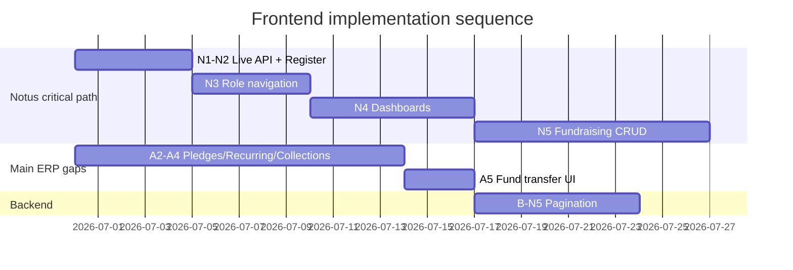

# Frontend Feature Audit & Implementation Plan

**Date:** June 29, 2026  
**Scope:** All frontend documentation vs actual code in `frontend/` and `frontend-notus/`  
**Backend reference:** Phases 1–10 implemented (`docs/PHASE*_IMPLEMENTATION.md`)

---

## Executive summary

| Track | App | Port | Design | Maturity |
|-------|-----|------|--------|----------|
| **ERP edition** | `frontend/` | 3000 | shadcn / CrossLife tokens | **~85%** of planned screens |
| **Notus edition** | `frontend-notus/` | 3001 | Creative Tim Notus template | **~15%** (shell + partial lists) |

The **backend is ahead of the documentation**: `GAP_ANALYSIS.md`, `MODULES.md`, and `SCREEN_INVENTORY.md` still describe an early skeleton, but the API layer is largely complete. The **main frontend is also ahead of its phase plan** (`FRONTEND_PHASE_PLAN.md` still says “no frontend exists”). The **Notus frontend** is intentionally behind — only N0 is complete; N1–N3 are partial.

**Recommended strategy:** Treat `frontend/` as the **functional reference**. Port features into `frontend-notus/` phase-by-phase (N1–N12) reusing shared API/types from `frontend/src` via path aliases — do not rebuild business logic twice.

---

## Documentation health

| Document | Says | Reality | Action |
|----------|------|---------|--------|
| `SCREEN_INVENTORY.md` | All dashboards “Planned” | Implemented in `frontend/` | Update statuses |
| `MODULES.md` | Auth, campaigns “Planned” | Backend + UI exist | Update statuses |
| `GAP_ANALYSIS.md` | ~15% PRD alignment | Pre-Phase-1 snapshot | Mark historical or rewrite |
| `FRONTEND_PHASE_PLAN.md` | F1–F11 plan, no app | `frontend/` has ~80 routes | Add **current status** section |
| `FRONTEND_NOTUS_PHASE_PLAN.md` | N0 ✅, N1–N3 partial | Accurate | Keep as Notus roadmap |
| `BACKEND_NOTUS_PHASE_PLAN.md` | B-N1 ✅ | Accurate | Keep as backend enablement map |

---

## Feature inventory — `frontend/` (ERP edition)

Legend: ✅ Done · 🔶 Partial · ⬜ Missing · — Backend only

### Foundation (F1)

| Feature | Status | Notes |
|---------|--------|-------|
| Next.js 15 App Router + TS | ✅ | |
| API client + JWT | ✅ | `lib/api/client.ts` |
| TanStack Query + Zustand auth | ✅ | |
| Mock API mode | ✅ | `NEXT_PUBLIC_MOCK_API` |
| Login / Register | ✅ | Auth slider UI |
| Auth guards | ✅ | |
| App shell (sidebar, top nav) | ✅ | Mobile drawer, loading states |
| CrossLife theme + dark mode | ✅ | `next-themes` |
| Command palette (⌘K) | ✅ | Module navigation |
| CORS to backend | ✅ | Backend `CorsConfig` + dev seed |

### Shared components (F2)

| Feature | Status | Notes |
|---------|--------|-------|
| DataTable | ✅ | Used across modules |
| FilterBar | ✅ | Client-side search |
| PageHeader / SectionHeader | ✅ | |
| Form primitives (RHF + Zod) | ✅ | Module forms |
| Loading / error / empty states | ✅ | Branded loader |
| PermissionGate / RoleGuard | ✅ | On create actions |
| ActivityTimeline | 🔶 | Donor detail only; not all detail pages |
| AuditTrail | 🔶 | Expense, budget, user detail |

### Dashboards (F3)

| Screen | Route | Status | API |
|--------|-------|--------|-----|
| Executive | `/dashboard/executive` | ✅ | `/analytics/dashboard`, `/trends`, `/insights` |
| Finance | `/dashboard/finance` | ✅ | Same analytics endpoints |
| Fundraising | `/dashboard/fundraising` | ✅ | Same analytics endpoints |
| Role home redirect | `/` | ✅ | By role |

### Fundraising (F4)

| Screen | Status | API client | Gap |
|--------|--------|------------|-----|
| Donor list/detail/create/edit | ✅ | `donors.ts` | — |
| Campaign list/detail/create/edit | ✅ | `campaigns.ts` | — |
| Donation list/detail/record | ✅ | `donations.ts` | Payment step on create flow |
| Receipt preview | ✅ | `previewReceipt` | — |
| **Pledges** | ⬜ | — | Backend `/api/v1/pledges` exists |
| **Recurring donations** | ⬜ | — | Backend `/api/v1/recurring-donations` exists |
| **Collection sessions** | ⬜ | — | Backend exists (Phase 2.5) |

### Finance (F5)

| Screen | Status | Gap |
|--------|--------|-----|
| Funds list/detail/create/edit | ✅ | — |
| Fund transfer **history** | ✅ | Read on fund detail |
| Fund transfer **create** | ⬜ | API `transferFunds` exists, no UI |
| Budgets list/detail/create/edit | ✅ | Lines, approve, activate |
| Expenses list/detail/create | ✅ | — |
| Expense workflow (submit/approve/reject/pay) | ✅ | `expense-workflow-panel.tsx` |

### Accounting (F6)

| Screen | Status |
|--------|--------|
| Chart of accounts | ✅ |
| Journal entries list/detail | ✅ |
| General ledger | ✅ |
| Trial balance | ✅ |
| Initialize COA | ✅ |

### Reporting (F7)

| Screen | Status | Gap |
|--------|--------|-----|
| Reports hub | ✅ | |
| Financial / donations / campaigns / budgets | ✅ | CSV export via `export-actions.tsx` |
| PDF export | ⬜ | Not implemented |

### Administration (F8)

| Screen | Status | Gap |
|--------|--------|-----|
| Users list/invite/detail | ✅ | |
| Org settings | ✅ | `/admin/settings` |
| Org setup wizard | ✅ | `/admin/setup` |

### Programs & verticals (F9)

| Module | Status |
|--------|--------|
| Programs | ✅ |
| Grants | ✅ |
| Beneficiaries | ✅ |
| Church ministries / attendance | ✅ |
| School sponsorships | ✅ |

### Platform owner (F10)

| Screen | Status |
|--------|--------|
| Platform login / bootstrap | ✅ |
| Owner dashboard | ✅ |
| Organizations / users / logs | ✅ |

### Advanced / polish (F11)

| Feature | Status |
|---------|--------|
| Pledges UI | ⬜ |
| Recurring UI | ⬜ |
| Collections UI | ⬜ |
| Communications center UI | ⬜ |
| Server-side pagination | ⬜ | All lists client-filter full arrays |
| Real audit/activity from API | 🔶 | Some pages use static/sample data |
| OpenAPI-generated types | ⬜ | Hand-maintained DTOs |

---

## Feature inventory — `frontend-notus/` (Notus edition)

| Phase | Feature | Status |
|-------|---------|--------|
| N0 | Notus theme, FA icons, layouts, reference page | ✅ |
| N1 | App Router, providers, auth guards, mock API | 🔶 | Live API wiring optional |
| N2 | Login (template markup) | 🔶 | Register page missing |
| N3 | Sidebar (basic ERP links) | 🔶 | No role/org-type nav filter; no finance/accounting sections |
| N4 | Role dashboards (3) | ⬜ | Single `/dashboard` with basic KPIs |
| N5 | Donors CRUD | 🔶 | List only; wrong column mapping; no detail/forms |
| N5 | Campaigns | ⬜ | Stub page |
| N5 | Donations | 🔶 | List only |
| N6–N12 | Finance, accounting, reports, admin, verticals, platform | ⬜ | Stubs or missing routes |

**Notus shares** API layer via `@/` → `../frontend/src` — no need to duplicate `lib/api/*`.

---

## Backend vs frontend gaps

| Backend capability | Main `frontend/` | `frontend-notus/` |
|--------------------|------------------|-------------------|
| Auth + org | ✅ | 🔶 login only |
| Analytics dashboards | ✅ | 🔶 basic dashboard |
| Donors / campaigns / donations | ✅ / ✅ / ✅ | 🔶 / ⬜ / 🔶 |
| Pledges / recurring / collections | ⬜ | ⬜ |
| Funds / budgets / expenses | ✅ | ⬜ |
| Accounting | ✅ | ⬜ |
| Reports | ✅ | ⬜ |
| Programs / grants / church / school | ✅ | ⬜ |
| Platform owner | ✅ | ⬜ |
| Dev demo seed + CORS | ✅ | ✅ (use `DEV_SEED_ENABLED=true`) |

---

## Unified implementation plan

### Track A — Complete main ERP (`frontend/`)

Priority fixes to reach “production-ready ERP UI” per `FRONTEND_PHASE_PLAN.md` success criteria.

| Step | Work | Effort | Unblocks |
|------|------|--------|----------|
| **A1** | Update `SCREEN_INVENTORY.md` + `FRONTEND_PHASE_PLAN.md` status | S | Team clarity |
| **A2** | Pledges module UI (list, create, detail) + `lib/api/pledges.ts` | M | F11 |
| **A3** | Recurring donations UI + API client | M | F11 |
| **A4** | Collection sessions UI | M | F11 |
| **A5** | Fund transfer create dialog on fund detail | S | F5 exit criteria |
| **A6** | Wire ActivityTimeline / AuditTrail to real observability APIs where available | M | WORKFLOWS compliance |
| **A7** | Server-side pagination (start with donors, donations) when backend adds `page`/`size` | M | Scale |
| **A8** | PDF report export (optional) | L | F7 polish |

### Track B — Notus edition (`frontend-notus/`)

Follow `FRONTEND_NOTUS_PHASE_PLAN.md` sprints; reuse Track A pages as **behavior reference**, Notus components as **visual shell**.

| Sprint | Phases | Deliverables | Reuse from `frontend/` |
|--------|--------|--------------|------------------------|
| **1** | N1–N2 | Live API default, register page, org setup | `register` form logic, `organization.ts` |
| **2** | N3 | Full sidebar (role + org-type), home redirect | `navigation.ts`, `usePermissions` |
| **3** | N4 | 3 dashboards with HeaderStats + Chart.js cards | `use-analytics` hooks |
| **4** | N5 | Donor/campaign/donation CRUD in Notus cards | Feature components → Notus markup port |
| **5** | N6 | Funds, budgets, expenses + workflow | `expense-workflow-panel` logic |
| **6** | N7–N8 | Accounting tables + report hub | Table/report pages |
| **7** | N9–N10 | Users, settings, verticals | Admin + church/school pages |
| **8** | N11–N12 | Platform shell, loading/errors/a11y | Platform routes |

### Track C — Backend enablement (`BACKEND_NOTUS_PHASE_PLAN.md`)

Only where UI needs API improvements:

| Phase | When needed | Work |
|-------|-------------|------|
| B-N5 | Notus N5 + A7 | Paginated/filtered list endpoints |
| B-N6 | Notus N6 | Expense filters, transfer validation messages |
| B-N7 | Notus N7 | Idempotent COA init |
| B-N8 | Notus N8 / A8 | Export formats |
| F11 APIs | A2–A4 | Already exist — add API clients only |

---

## Recommended execution order (next 8 weeks)

**Immediate next steps (this week):**

1. **Notus N1–N2:** Set `NEXT_PUBLIC_MOCK_API=false`, verify login against `DEV_SEED_ENABLED=true` backend; add `/register` with Notus template card.
2. **Notus N3:** Port `navigationGroups` into Notus sidebar with FA icons + `lightBlue-500` active state; filter by role and `organizationType`.
3. **Main A2:** Add `lib/api/pledges.ts` + `/pledges` routes (list/create/detail) — highest backend/UI gap on the primary app.
4. **Docs:** Update `SCREEN_INVENTORY.md` dashboard rows to **Done** for `frontend/`.

---

## Success criteria checklist

### Main `frontend/` (F1–F10)

- [x] Every SCREEN_INVENTORY screen routed (except pledges/recurring/collections)
- [x] Shared DataTable pattern
- [x] RBAC PermissionGate on mutations
- [x] Three role dashboards
- [x] Platform owner at `/platform/dashboard`
- [x] Light + dark theme
- [x] Command palette
- [ ] Pledges / recurring / collections (F11)
- [ ] Fund transfer create
- [ ] SCREEN_INVENTORY doc synced

### `frontend-notus/` (N0–N12)

- [x] N0 fidelity checklist
- [ ] N1–N3 complete
- [ ] N4–N12 not started
- [ ] Screenshot parity with Notus template per module

---

## Reference map

| Need | Read |
|------|------|
| All screens | `docs/SCREEN_INVENTORY.md` |
| IA / domains | `docs/INFORMATION_ARCHITECTURE.md` |
| Workflows | `docs/WORKFLOWS.md` |
| Permissions | `docs/RBAC_MATRIX.md` |
| ERP phase plan | `docs/FRONTEND_PHASE_PLAN.md` |
| Notus phase plan | `docs/FRONTEND_NOTUS_PHASE_PLAN.md` |
| Backend for Notus | `docs/BACKEND_NOTUS_PHASE_PLAN.md` |
| API list | `docs/PHASE*_IMPLEMENTATION.md`, Swagger `/swagger-ui.html` |
| Working UI reference | `frontend/src/app/(app)/**` |
| Notus visual reference | `Notus-Next.js-1.0.0/`, `/dev/notus-reference` |

---

*This audit should be updated when each sprint completes — especially `SCREEN_INVENTORY.md` and the status tables in both phase plans.*
