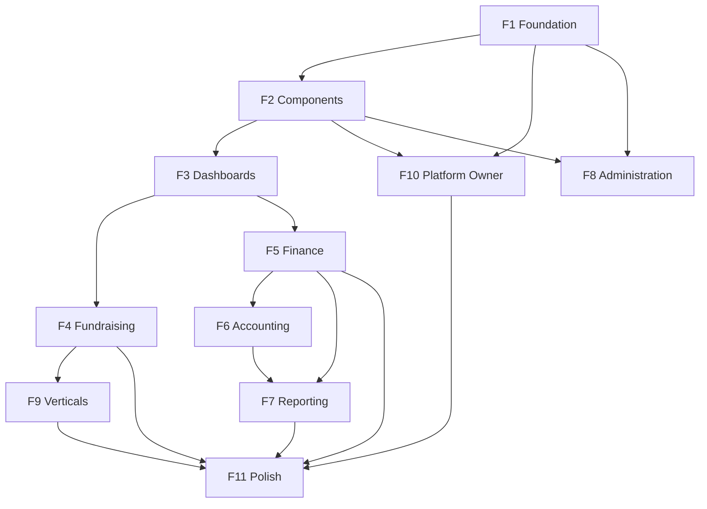

# FundFlow ERP — Frontend Phase Plan

**Version:** 1.0  
**Status:** Planning  
**Guiding docs:** [DESIGN_SYSTEM.md](./DESIGN_SYSTEM.md) · [FRONTEND_ARCHITECTURE.md](./FRONTEND_ARCHITECTURE.md) · [COMPONENT_INVENTORY.md](./COMPONENT_INVENTORY.md) · [SCREEN_INVENTORY.md](./SCREEN_INVENTORY.md) · [INFORMATION_ARCHITECTURE.md](./INFORMATION_ARCHITECTURE.md) · [WORKFLOWS.md](./WORKFLOWS.md) · [RBAC_MATRIX.md](./RBAC_MATRIX.md) · [PLATFORM_OBSERVABILITY.md](./PLATFORM_OBSERVABILITY.md)

---

## Principles (non-negotiable)

Every phase must follow these rules from the design docs:

| Rule | Source |
|------|--------|
| Next.js App Router + TypeScript + Tailwind + shadcn/ui | FRONTEND_ARCHITECTURE |
| Shared `DataTable`, `PageHeader`, `FilterBar` — no module-specific tables | COMPONENT_INVENTORY |
| React Hook Form + Zod for all forms | WORKFLOWS / DESIGN_SYSTEM |
| TanStack Query for server state; Zustand for UI/auth only | FRONTEND_ARCHITECTURE |
| Role-aware sidebar; three tenant dashboards (Executive, Finance, Fundraising) | DESIGN_SYSTEM |
| Cmd/Ctrl+K command palette for global search | DESIGN_SYSTEM |
| Light + dark theme via design tokens | DESIGN_SYSTEM |
| Permissions: backend → API → `PermissionGate` / `RoleGuard` | FRONTEND_ARCHITECTURE |
| Workflows end-to-end with `ActivityTimeline` + `AuditTrail` on detail screens | WORKFLOWS |

**Repo note:** No frontend exists yet. Backend APIs are implemented through Phase 10 (+ platform owner dashboard). This plan builds UI against those APIs.

**Monorepo layout:** All frontend code lives in the **`frontend/`** directory at the repository root. The Spring Boot backend stays in `src/main/java/`. Do not place Next.js app files at the repo root or inside the Java `src/` tree.

```
daisyFoDonation/
├── frontend/                 ← Next.js application (all phases)
│   ├── src/
│   ├── public/
│   ├── package.json
│   └── ...
├── src/main/java/            ← Spring Boot backend
├── docs/
└── pom.xml
```

---

## Phase overview

| Phase | Name | Focus | Depends on |
|-------|------|-------|------------|
| **F1** | Foundation & shell | Tooling, auth, layout, tokens | — |
| **F2** | Shared component library | DataTable, forms, feedback, workflow primitives | F1 |
| **F3** | Role dashboards & navigation | Executive / Finance / Fundraising home | F1, F2 |
| **F4** | Fundraising core | Donors, campaigns, donations | F2, F3 |
| **F5** | Finance core | Funds, budgets, expenses + approvals | F2, F3 |
| **F6** | Accounting & ledger | COA, journals, GL, trial balance | F5 |
| **F7** | Reporting center | Financial & operational reports + export | F5, F6 |
| **F8** | Administration | Users, org settings, onboarding | F1, F2 |
| **F9** | Programs & verticals | Grants, programs, church, school, NGO | F4, F5 |
| **F10** | Platform owner dashboard | Super-admin control center | F1, F2 |
| **F11** | Advanced fundraising & polish | Pledges, recurring, collections, comms, performance | F4+ |

---

## F1 — Foundation & application shell

**Goal:** Runnable Next.js app with auth, API layer, and authenticated layout.

### Deliverables

**Project scaffold** (inside `frontend/`)
- Create Next.js app at `frontend/` — App Router, TypeScript strict, Tailwind, shadcn/ui
- Design tokens in `frontend/src/app/globals.css` (CSS variables) — light/dark
- ESLint + Prettier in `frontend/`; root may delegate via workspace scripts if desired

**Folder structure** (`frontend/src/` — per FRONTEND_ARCHITECTURE)
```
frontend/
├── package.json
├── next.config.ts
├── tailwind.config.ts
├── tsconfig.json
├── .env.local.example
├── public/
└── src/
    ├── app/
    │   ├── (auth)/login, register
    │   ├── (app)/              → tenant authenticated routes
    │   ├── platform/           → super-admin routes (F10)
    │   └── layout.tsx
    ├── features/
    │   ├── dashboard/
    │   ├── donors/
    │   ├── campaigns/
    │   └── ...
    ├── components/
    │   ├── ui/                 → shadcn primitives
    │   ├── layout/             → AppShell, Sidebar, TopNavigation
    │   ├── tables/
    │   ├── forms/
    │   └── charts/
    ├── lib/
    │   ├── api/                → fetch client, error handling
    │   ├── auth/               → token storage
    │   └── utils/
    ├── stores/                 → Zustand (auth/UI only)
    ├── hooks/                  → useAuth, usePermissions
    └── types/                  → API DTOs mirroring backend
```

**API client**
- Base URL from env (`NEXT_PUBLIC_API_URL`)
- JWT `Authorization: Bearer` on all requests
- `X-Organization-Id` header support (for super-admin tenant context later)
- Typed responses matching `ApiResponse<T>`
- TanStack Query provider + default error/toast handling

**Auth screens**
| Screen | Route | API |
|--------|-------|-----|
| Login | `/login` | `POST /api/v1/auth/login` |
| Register (org onboarding) | `/register` | `POST /api/v1/auth/register` |
| Current user bootstrap | app load | `GET /api/v1/auth/me` |

**Layout components** (COMPONENT_INVENTORY)
- `AppShell` — header + sidebar + content
- `ContentContainer` — max-width + padding
- `Sidebar` — collapsible, role-aware (empty nav items until F3)
- `TopNavigation` — user menu placeholder
- `LoadingState` — skeleton default

**Security**
- Auth route guard (redirect unauthenticated → `/login`)
- `RoleGuard` + `PermissionGate` shells (wired in F3)
- No API data in Zustand

### Exit criteria
- [ ] `frontend/` app runs with `npm run dev` from that directory
- [ ] User can register an organization and log in
- [ ] JWT persists across refresh; logout clears session
- [ ] Authenticated pages render inside `AppShell` with dark mode toggle
- [ ] API errors surface via `ErrorAlert`

### Screens (SCREEN_INVENTORY)
- Organization onboarding entry via Register (partial — full setup in F8)

---

## F2 — Shared component library

**Goal:** All list/detail/form pages can be built from approved primitives.

### Deliverables

**Data display**
| Component | Built with | Notes |
|-----------|------------|-------|
| `PageHeader` | shadcn | Breadcrumbs, title, description, primary action |
| `SectionHeader` | shadcn | Subsections on detail pages |
| `DataTable` | TanStack Table | Search, sort, filter, pagination, column visibility, export hook, bulk action slot |
| `FilterBar` | composes inputs | Search + filter chips + reset |
| `EntityHeader` | shadcn | Title, `StatusBadge`, metadata, action menu |
| `DetailCard` | shadcn Card | Grouped read-only fields |
| `StatusBadge` | shadcn Badge | Draft, Pending, Approved, Rejected, Completed, Archived |
| `EmptyState` | Lucide + CTA | All list pages |

**Forms**
| Component | Notes |
|-----------|-------|
| `FormSection` | Groups fields |
| `FormField` | Label, description, error from RHF |
| `CurrencyInput` | Formatted money |
| `DateInput` | shadcn date picker + date-fns |
| `EntitySelector` | Async combobox (donor, fund, campaign) |
| `FileUploader` | Drag-drop stub (full in F11) |

**Feedback**
- `SuccessAlert`, `ErrorAlert`, `WarningAlert`
- `ConfirmDialog` — destructive actions
- Toast system (shadcn Sonner)

**Workflow**
- `ActivityTimeline` — chronological events (UI shell; data in F4+)
- `AuditTrail` — immutable history table (UI shell)
- `WorkflowStatus` — step indicator
- `ApprovalWorkflow` — approve / reject / return (wired in F5)

**Navigation**
- `Breadcrumbs`
- `CommandPalette` — Cmd/Ctrl+K shell (entity search wired per phase)

**Dashboard widgets** (building blocks for F3)
- `KPIWidget`, `MetricCard`, `TrendChart` (Recharts), `RecentActivityFeed`

**Patterns**
- Standard list page template: `PageHeader` → `FilterBar` → `DataTable`
- Standard detail page: `EntityHeader` → `DetailCard` tabs → `ActivityTimeline`
- Standard form page: `PageHeader` → RHF form with `FormSection`s → unsaved-changes guard

### Exit criteria
- [ ] Storybook or internal `/dev/components` showcase page documents all primitives
- [ ] One reference list page and one reference form using only shared components
- [ ] `DataTable` used in reference — no raw HTML tables elsewhere

---

## F3 — Role dashboards & navigation

**Goal:** Role-specific home screens and sidebar; no single universal tenant dashboard.

### Deliverables

**Navigation config**
- Central `navigation.ts` driven by `Role` + `OrganizationType`
- Sidebar groups per INFORMATION_ARCHITECTURE: Dashboard, Fundraising, Finance, Reporting, Administration, Verticals
- `PermissionGate` hides items user cannot access

**Dashboard routes**
| Dashboard | Primary roles | Route | API |
|-----------|---------------|-------|-----|
| Executive | ORG_ADMIN | `/dashboard/executive` | `GET /api/v1/analytics/dashboard`, `/insights` |
| Finance | FINANCE_MANAGER, ACCOUNTANT | `/dashboard/finance` | analytics + fund/expense summaries |
| Fundraising | FUNDRAISING_MANAGER | `/dashboard/fundraising` | analytics + campaign summaries |

**Default redirect:** after login, route user to dashboard matching primary role (ORG_ADMIN → Executive).

**Executive dashboard widgets** (DESIGN_SYSTEM)
- Fund balance, budget utilization, donation trends, campaign performance, pending approvals
- `TrendChart` from `GET /api/v1/analytics/trends`
- Insights panel from `GET /api/v1/analytics/insights`

**Finance dashboard widgets**
- Cash position, expense trends, budget variance, fund balances, recent transactions

**Fundraising dashboard widgets**
- Active campaigns, donation growth, top donors, campaign effectiveness, recent contributions

**Command palette v1**
- Navigate to modules
- Quick actions: Record Donation, Create Expense (role-gated)

### Exit criteria
- [ ] Three distinct dashboard pages; widgets differ by role
- [ ] Sidebar only shows modules the role may access (per RBAC_MATRIX)
- [ ] Command palette opens with Cmd/Ctrl+K

### Screens (SCREEN_INVENTORY)
| Screen | Status after F3 |
|--------|-----------------|
| Executive Dashboard | Done |
| Finance Dashboard | Done |
| Fundraising Dashboard | Done |

---

## F4 — Fundraising module

**Goal:** Complete donation workflow UI — donor → donation → receipt traceability.

**Workflow:** WORKFLOWS § Donation, Campaign

### Routes & screens
| Screen | Route | API |
|--------|-------|-----|
| Donor List | `/donors` | `GET /api/v1/donors` |
| Donor Detail | `/donors/[id]` | `GET /api/v1/donors/{id}` |
| Create / Edit Donor | `/donors/new`, `/donors/[id]/edit` | POST, PUT |
| Campaign List | `/campaigns` | `GET /api/v1/campaigns` |
| Campaign Detail | `/campaigns/[id]` | GET + metrics |
| Create / Edit Campaign | `/campaigns/new`, `/campaigns/[id]/edit` | POST, PUT |
| Donation List | `/donations` | `GET /api/v1/donations` |
| Donation Detail | `/donations/[id]` | GET |
| Record Donation | `/donations/new` | POST |

### Features
- All lists use `DataTable` + `FilterBar`
- Donor detail: donations tab, `ActivityTimeline`
- Record Donation: `EntitySelector` for donor, campaign, fund
- Donation detail: link to receipt (communications), ledger entry placeholder (F6)
- Campaign detail: progress toward goal, linked donations
- Command palette: search donors, campaigns, donations

### Exit criteria
- [ ] Full donation workflow navigable without leaving coherent UI flow
- [ ] Status badges match backend enums
- [ ] Create/edit forms use RHF + Zod with server validation errors mapped

### Screens (SCREEN_INVENTORY)
- Donors (4), Campaigns (4), Donations (3) — **Done**

---

## F5 — Finance module

**Goal:** Funds, budgets, expenses with approval workflow.

**Workflows:** WORKFLOWS § Expense, Budget, Fund Management

### Routes & screens
| Screen | Route | API |
|--------|-------|-----|
| Fund List / Detail / Create | `/funds`, `/funds/[id]`, `/funds/new` | `/api/v1/funds` |
| Budget List / Detail / Create | `/budgets`, … | `/api/v1/budgets` |
| Expense List / Detail / Create | `/expenses`, … | `/api/v1/expenses` |
| Expense Approval | `/expenses/[id]` (approval panel) | approve / pay actions |

### Features
- `ApprovalWorkflow` on expense detail (submit → approve → reject → pay)
- Budget detail: allocations, utilization vs plan
- Fund detail: balance, transaction history
- Finance dashboard widgets refresh from live data
- `AuditTrail` on expenses and budgets

### Exit criteria
- [ ] Expense workflow matches WORKFLOWS: create → submit → approve → pay
- [ ] Budget variance visible on budget detail
- [ ] Role gates: only FINANCE_MANAGER / ORG_ADMIN see approve actions

### Screens (SCREEN_INVENTORY)
- Funds (3), Budgets (3), Expenses (3) — **Done**

---

## F6 — Accounting module

**Goal:** Ledger visibility and chart of accounts management.

**Workflow:** WORKFLOWS § Accounting

### Routes & screens
| Screen | Route | API |
|--------|-------|-----|
| Chart of Accounts | `/accounting/chart-of-accounts` | accounting COA endpoints |
| Journal Entries | `/accounting/journal-entries` | list + detail |
| General Ledger | `/accounting/general-ledger` | report view |
| Trial Balance | `/accounting/trial-balance` | report view |

### Features
- `ReportTable` (DataTable-based) for GL and trial balance
- Journal entry detail links back to source donation/expense (traceability)
- Donation detail (F4) — add ledger entry link when posting exists
- Read-heavy for ACCOUNTANT; write for ORG_ADMIN / FINANCE_MANAGER per RBAC

### Exit criteria
- [ ] User can trace donation → journal entry from UI
- [ ] GL and trial balance support date range via `ReportFilters`

### Screens (SCREEN_INVENTORY)
- Accounting (4) — **Done**

---

## F7 — Reporting center

**Goal:** Unified report hub with filters and export.

**Workflow:** WORKFLOWS § Reporting

### Routes & screens
| Screen | Route | API |
|--------|-------|-----|
| Report Center | `/reports` | hub |
| Financial Reports | `/reports/financial` | `/api/v1/reports` |
| Donation Reports | `/reports/donations` | |
| Campaign Reports | `/reports/campaigns` | |
| Budget Reports | `/reports/budgets` | |

### Features
- `ReportFilters` — date range, fund, campaign, organization
- `ReportSummary` KPI row + `ReportTable` + `TrendChart`
- `ExportActions` — CSV first; PDF/Excel when backend supports
- Command palette includes reports

### Exit criteria
- [ ] At least one report per category with export
- [ ] Filters consistent across all report pages

### Screens (SCREEN_INVENTORY)
- Reporting (4) — **Done**

---

## F8 — Administration & org onboarding

**Goal:** Tenant admin can manage users and organization settings.

**Workflows:** WORKFLOWS § User Management, Organization Onboarding

### Routes & screens
| Screen | Route | API |
|--------|-------|-----|
| User List | `/admin/users` | `GET /api/v1/users` |
| Invite User | `/admin/users/new` | `POST /api/v1/users` |
| User Detail / Edit role | `/admin/users/[id]` | GET, PUT role |
| Organization Profile | `/admin/settings` | `GET/PUT /api/v1/organizations` |
| Organization setup wizard | `/admin/setup` | post-register guided flow |

### Features
- ORG_ADMIN only (`RoleGuard`)
- Invite form: email, name, role (exclude SUPER_ADMIN, DONOR)
- Setup wizard: profile → invite team → module checklist
- `AuditTrail` on user changes

### Exit criteria
- [ ] New org admin completes onboarding wizard after register
- [ ] User invite + role change reflected in list without reload (Query invalidation)

### Screens (SCREEN_INVENTORY)
- Administration users — **Done** (roles/permissions read-only until backend expands)

---

## F9 — Programs & vertical modules

**Goal:** Organization-type-specific features behind vertical nav.

### Routes (feature-gated by `OrganizationType`)

**Programs & grants** (NGO, School)
| Screen | Route | API |
|--------|-------|-----|
| Programs | `/programs` | `/api/v1/programs` |
| Grants | `/grants` | `/api/v1/grants` |
| Beneficiaries | `/beneficiaries` | `/api/v1/beneficiaries` |

**Church** (`CHURCH`)
| Screen | Route | API |
|--------|-------|-----|
| Ministries | `/church/ministries` | `/api/v1/church/ministries` |
| Attendance | `/church/attendance` | church endpoints |

**School** (`SCHOOL`)
| Screen | Route | API |
|--------|-------|-----|
| Sponsorships | `/school/sponsorships` | `/api/v1/school/sponsorships` |

### Features
- Sidebar vertical section only when `organization.type` matches
- Reuse list/detail/form patterns from F4/F5
- PROGRAM_MANAGER role navigation

### Exit criteria
- [ ] Church org sees church nav; NGO does not
- [ ] Program and grant list/detail functional

---

## F10 — Platform owner dashboard (SUPER_ADMIN)

**Goal:** Separate app area for platform owner — not mixed with tenant ERP.

**Docs:** PLATFORM_OBSERVABILITY.md, RBAC_MATRIX platform section

### Routes
| Screen | Route | API |
|--------|-------|-----|
| Owner login | `/platform/login` | same auth; role check |
| Owner dashboard | `/platform/dashboard` | `GET /api/v1/platform/dashboard` |
| Organizations | `/platform/dashboard/organizations` | nested in dashboard or tabs |
| Users | `/platform/dashboard/users` | |
| System logs | `/platform/dashboard/logs` | search + filters |
| Alert detail / resolve | `/platform/dashboard/logs/[id]` | PUT resolve |
| Bootstrap (dev only) | `/platform/bootstrap` | `POST /api/v1/platform/bootstrap` |

### Features
- **Separate layout** from tenant `AppShell` (platform branding subtle difference optional)
- Single `GET /dashboard` populates: stats, all orgs, all users, recent activity, alerts, errors
- `DataTable` for organizations, users, logs
- **Tenant switcher** in platform context: select org → sets `X-Organization-Id` → deep link into tenant view (read-only or impersonation mode)
- Log filters: type, severity, category, org, alertsOnly, date range
- `MetricCard` for 24h errors, security events, unresolved alerts
- SUPER_ADMIN never lands on tenant Executive dashboard by default

### Exit criteria
- [ ] Super admin sees full platform snapshot on one page
- [ ] Can deactivate org, resolve alert, create super admin
- [ ] Org admin cannot access `/platform/*` routes

---

## F11 — Advanced modules & production polish

**Goal:** Remaining APIs, performance, and UX completeness.

### Scope
| Area | Routes / features | API |
|------|-------------------|-----|
| Pledges | `/pledges` | `/api/v1/pledges` |
| Recurring donations | `/recurring-donations` | recurring API |
| Collection sessions | `/collections` | collection API |
| Payments | on donation detail | payments API |
| Communications | receipt preview on donation | `/api/v1/communications` |
| Notifications | TopNavigation bell | future / email log |
| Analytics forecast | executive dashboard | `/api/v1/analytics/forecast` |

### Polish
- DataTable: saved views, optional virtualization for large lists
- Form draft autosave where WORKFLOWS requires it
- E2E tests (Playwright): login, record donation, approve expense
- Accessibility audit (Radix/shadcn baseline + keyboard nav)
- i18n hook points (optional, not required v1)

### Exit criteria
- [ ] All backend modules have at least list + detail UI or justified exclusion
- [ ] Lighthouse / a11y pass on core flows
- [ ] SCREEN_INVENTORY fully marked **Done**

---

## Cross-phase dependency diagram



---

## Suggested build order (sprints)

| Sprint | Phases | Outcome |
|--------|--------|---------|
| 1–2 | F1 | Login, register, shell, API client |
| 3 | F2 | Component library + reference pages |
| 4 | F3 | Dashboards + navigation + command palette |
| 5–6 | F4 | Donors, campaigns, donations |
| 7–8 | F5 | Funds, budgets, expenses |
| 9 | F6 | Accounting |
| 10 | F7 + F8 | Reports + admin (parallel possible) |
| 11 | F9 | Verticals |
| 12 | F10 | Platform owner dashboard |
| 13+ | F11 | Advanced + polish |

---

## Environment & integration

**Frontend env** (`frontend/.env.local`):

```env
NEXT_PUBLIC_API_URL=http://localhost:8080
```

Copy from `frontend/.env.local.example` when scaffolding F1.

**CORS:** Backend must allow the frontend dev origin (e.g. `http://localhost:3000`) during development.

**Auth:** Store JWT in httpOnly cookie (preferred) or secure memory + refresh strategy — decide in F1 and document in FRONTEND_ARCHITECTURE.md.

**Types:** Generate OpenAPI client into `frontend/src/types/api/` from `/v3/api-docs` (optional F2 task) or hand-maintain DTOs from Swagger.

**Commands** (from repo root or `frontend/`):

```bash
cd frontend && npm install && npm run dev
```

---

## Doc updates required as frontend progresses

| When | Update |
|------|--------|
| F1 complete | FRONTEND_ARCHITECTURE.md — auth strategy, `frontend/` layout |
| F3 complete | SCREEN_INVENTORY.md — dashboard rows → Done |
| F10 complete | SCREEN_INVENTORY.md — add Platform Owner section |
| Each phase | Mark screens Done in SCREEN_INVENTORY.md |

**Recommended fix:** Split true visual tokens from `DESIGN_SYSTEM.md` (currently duplicates architecture content) when F1 starts.

---

## Success criteria (entire frontend)

- [ ] Every screen in SCREEN_INVENTORY implemented or explicitly deferred
- [ ] No module-specific table components
- [ ] All WORKFLOWS have a completable UI path
- [ ] RBAC enforced in UI matching RBAC_MATRIX
- [ ] Platform owner isolated at `/platform/dashboard`
- [ ] Cmd/Ctrl+K search across entities
- [ ] Light and dark themes fully supported

---

*Next step: approve this plan, then begin **F1** — scaffold the Next.js app in `frontend/`.*
