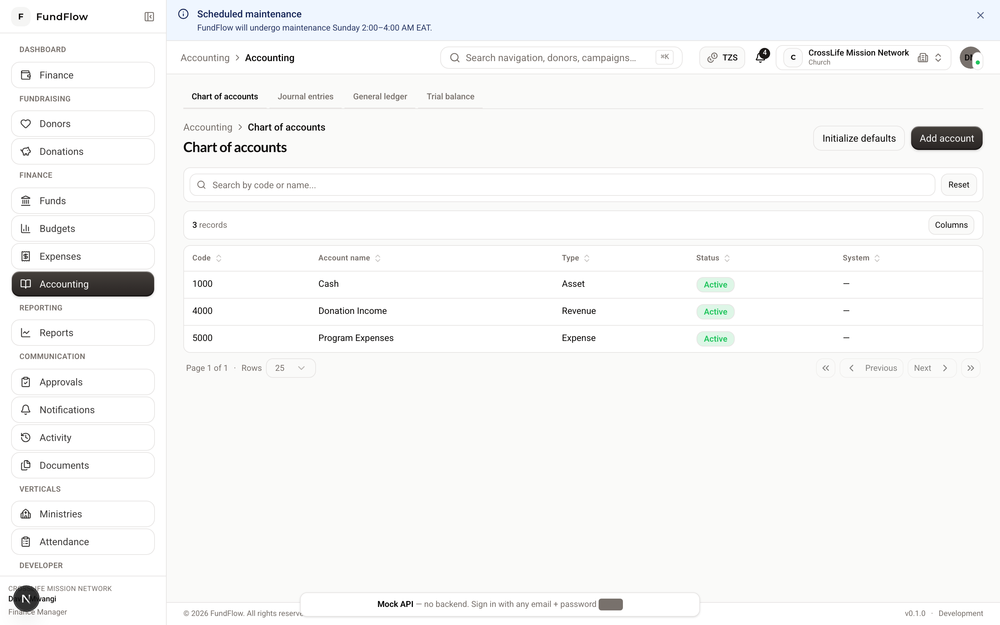
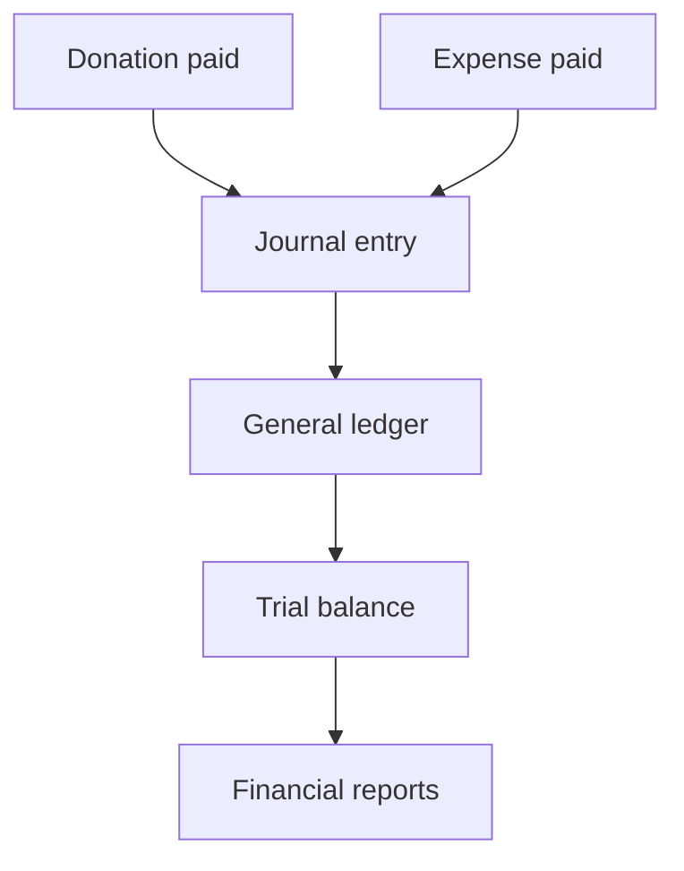

# Accounting Guide

**Audience:** `FINANCE_MANAGER`, `ACCOUNTANT`, `ORG_ADMIN`  
**Hub:** `/accounting/chart-of-accounts`

---

## What you do in FundFlow

FundFlow uses **double-entry accounting**. When donations are paid and expenses are settled, the system creates **journal entries** automatically. Your job is to:

- Maintain the **chart of accounts**  
- **Initialize** accounting for new organizations  
- Review **journal entries**, **general ledger**, and **trial balance**  
- Ensure every financial event is posted correctly before closing a period  

**Rule:** Balances are **calculated** from the ledger — never edit totals manually.

---

## Navigation

| Screen | Path |
|--------|------|
| Chart of accounts | `/accounting/chart-of-accounts` |
| Journal entries | `/accounting/journal-entries` |
| General ledger | `/accounting/general-ledger` |
| Trial balance | `/accounting/trial-balance` |

{ width="720" }

*Figure: Chart of accounts — initialize defaults and manage account structure.*



*Diagram: How transactions flow into accounting reports.*

---

## Guide 1 — Initialize accounting (new organization)

Do this once after funds are set up.

1. Go to **Finance → Accounting** (chart of accounts)  
2. Click **Initialize**  
3. Confirm — default accounts are created (assets, liabilities, equity, revenue, expenses)  

**Who can initialize:** Finance Manager, Org Admin  

**Who can add accounts:** Finance Manager, Org Admin, Accountant  

---

## Guide 2 — Understand automatic postings

| Business event | Typical ledger effect |
|----------------|----------------------|
| Donation paid | Debit Cash · Credit Donation Revenue |
| Expense paid | Debit Expense Account · Credit Cash |
| Fund transfer | Debit/Credit between fund accounts |

Every entry has matching debits and credits.

### Trace a transaction

**Forward trace (donation example):**

```
Donation detail → Payment → Journal entry → General ledger line
```

**Backward trace (ledger example):**

```
Ledger line → Journal entry → Source donation or expense
```

---

## Guide 3 — Review journal entries

1. **Accounting → Journal entries** (`/accounting/journal-entries`)  
2. Filter by date range  
3. Click an entry (`/accounting/journal-entries/[id]`) to see:
   - Entry date and reference  
   - Debit and credit lines per account  
   - Link to source document (donation, expense, etc.)  

Manual adjusting entries (if supported in your deployment) follow the same review process.

---

## Guide 4 — Run the general ledger

1. **Accounting → General ledger** (`/accounting/general-ledger`)  
2. Set **date range**  
3. Optionally filter by **account**  
4. Review all posted lines with running balances  

Use this for account-level reconciliation and auditor requests.

---

## Guide 5 — Run trial balance

1. **Accounting → Trial balance** (`/accounting/trial-balance`)  
2. Select **period end date**  
3. Verify **total debits = total credits**  

If they don't balance:

- Check for unpaid donations (payment not recorded)  
- Check for approved-but-unpaid expenses  
- Review recent journal entries for the period  

---

## Guide 6 — Chart of accounts maintenance

1. Open **Chart of accounts**  
2. To add an account:
   - Choose account **type** (Asset, Liability, Equity, Revenue, Expense)  
   - Enter **code** and **name**  
   - Save  
3. Avoid deleting accounts with posted history — use inactive status where available  

**Accountant** role can create accounts; **Finance Manager** handles initialization and oversight.

---

## Guide 7 — Period close (simplified)

| Step | Action |
|------|--------|
| 1 | Finance confirms all expenses paid/reconciled |
| 2 | Finance confirms all donation payments recorded |
| 3 | Run **Trial balance** — must balance |
| 4 | Run **General ledger** export for the period |
| 5 | Finance exports **Financial reports** |
| 6 | Auditor reviews **Activity** + ledger + source documents |

---

## What not to do

- Do not delete donations, payments, or journal entries  
- Do not bypass expense approval before payment  
- Do not store "balance" figures outside the system for official reporting  

Use statuses, reversals, and audit logs as designed.

---

## Permissions summary

| Action | Finance Manager | Accountant |
|--------|-----------------|------------|
| Initialize COA | ✓ | ✗ |
| Add accounts | ✓ | ✓ |
| View journal/ledger/trial balance | ✓ | ✓ |
| Approve expenses | ✓ | ✗ |

---

**Related:** [Finance Guide](./finance.md) · [Reports Guide](./reports.md) · [WORKFLOWS.md](../WORKFLOWS.md)
