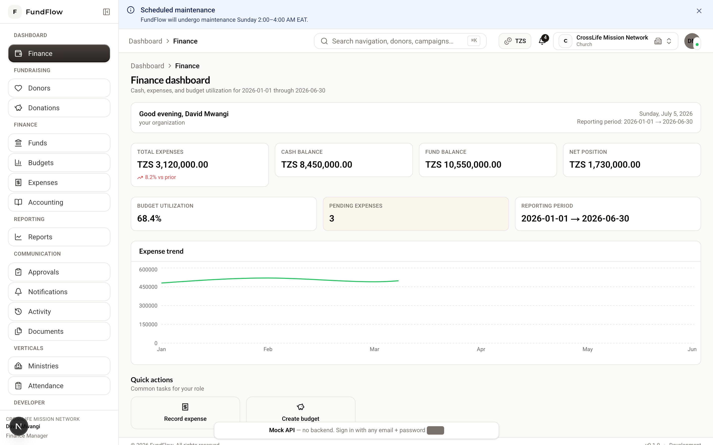
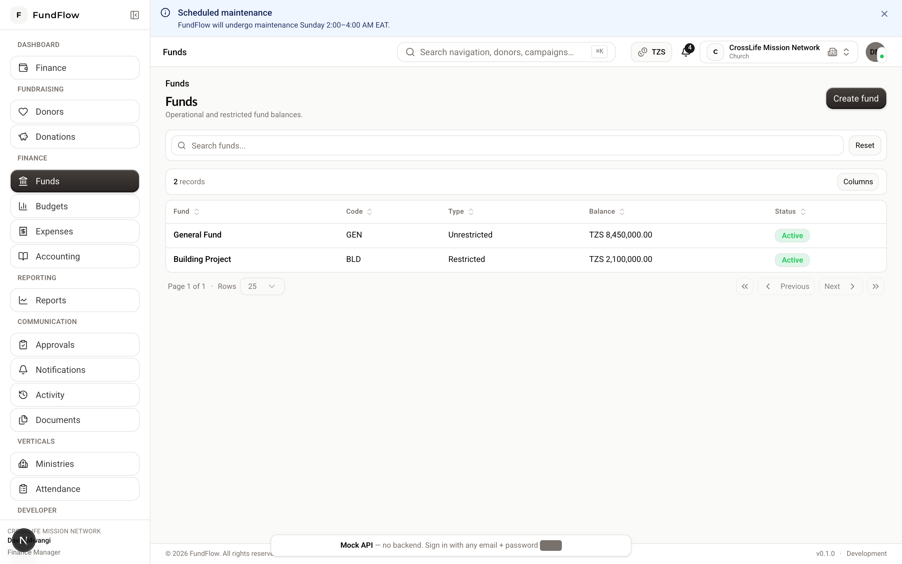
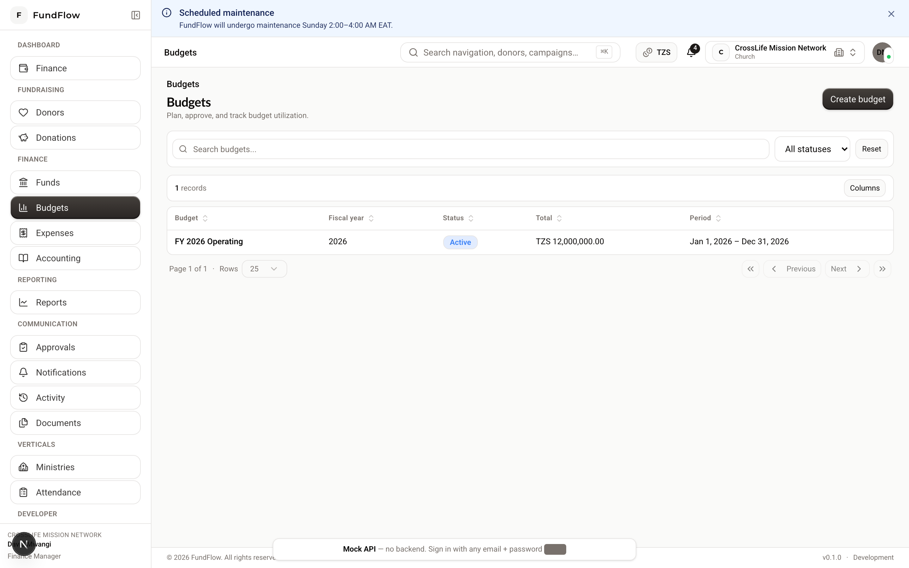
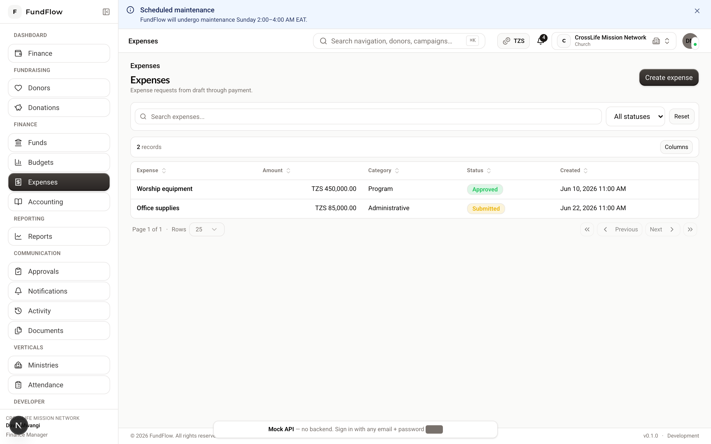
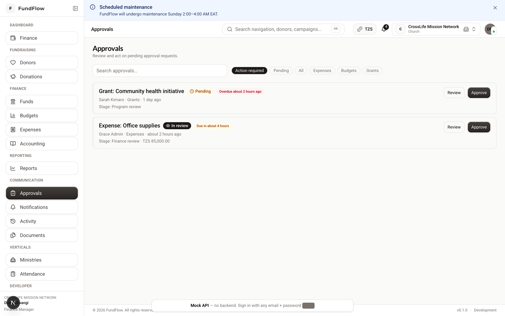

# Finance Guide

**Audience:** `FINANCE_MANAGER`, `STAFF` (limited), `ORG_ADMIN`  
**Dashboard:** `/dashboard/finance`

---

## What you do in FundFlow

- Define **funds** (restricted and unrestricted pools of money)  
- Plan **budgets** and track utilization  
- Process **expenses** through approval and payment  
- Approve workflow items in the **Approvals** inbox  

Accounting ledger work is covered in the [Accounting Guide](./accounting.md).

---

## Daily navigation

| Task | Path |
|------|------|
| Funds | `/funds` |
| Budgets | `/budgets` |
| Expenses | `/expenses` |
| Approvals | `/approvals` |
| Finance dashboard | `/dashboard/finance` |

{ width="720" }

*Figure: Finance dashboard — cash position, approvals, and budget utilization.*

---

## Guide 1 — Set up funds

Funds separate money by purpose (building fund, general operations, grant-specific, etc.).

1. **Finance → Funds → New fund** (`/funds/new`)  
2. Enter:
   - **Name** (e.g. "General Fund", "Building Fund")  
   - **Type:** Restricted or Unrestricted  
   - **Description**  
   - Opening balance (if migrating from another system)  
3. **Save**  

### Use funds day to day

- Fundraising assigns donations to funds  
- Expenses are charged against funds  
- Fund detail page shows balance and transaction history  

**Coordinate with fundraising** so new campaigns link to the correct fund.

{ width="720" }

*Figure: Funds — restricted and unrestricted pools with balances.*

---

## Guide 2 — Create a budget

1. **Finance → Budgets → New budget** (`/budgets/new`)  
2. Enter fiscal **period** (year or term) and **name**  
3. Add **budget lines** — accounts or categories with planned amounts  
4. Save as **Draft**  

{ width="720" }

*Figure: Budgets — fiscal periods, status, and utilization tracking.*

### Budget lifecycle

```
Draft → Submitted → Approved → Activated → (expenses tracked) → Closed
```

| Action | Who |
|--------|-----|
| Create / edit lines | Finance Manager, Org Admin |
| Approve / activate / close | Finance Manager, Org Admin |

### Monitor utilization

- Open budget **detail page** (`/budgets/[id]`)  
- Compare planned vs. actual spending  
- Run **Reports → Budget reports** for variance analysis  

---

## Guide 3 — Submit an expense (Staff)

1. **Finance → Expenses → New expense** (`/expenses/new`)  
2. Enter:
   - **Description** and **amount**  
   - **Date**  
   - **Fund** and budget line (if applicable)  
   - Payee / vendor details  
3. Attach receipt via **Documents** or expense attachments if available  
4. **Save** → **Submit for approval**  

Status changes to **Pending Review**.

{ width="720" }

*Figure: Expenses — filter by status and open items for approval.*

---

## Guide 4 — Approve or reject an expense (Finance Manager)

### Option A — Approvals inbox

1. **Communication → Approvals** (`/approvals`)  
2. Open the pending expense  
3. Review amount, fund, attachments  
4. **Approve** or **Reject** (add a comment if rejecting)  

{ width="720" }

*Figure: Approvals — centralized inbox for expenses and workflow items.*

### Option B — Expense detail

1. **Finance → Expenses** → click the expense  
2. Same approve/reject actions on the detail page  

---

## Guide 5 — Pay and reconcile an expense

After approval:

1. Open expense detail (`/expenses/[id]`)  
2. **Mark as paid** — record payment date and method  
3. **Reconcile** when matched to bank statement  

The system posts an **accounting journal entry** when payment is recorded.

```
Expense → Approved → Paid → Reconciled → Ledger updated → Reports updated
```

Only **Finance Manager** and **Org Admin** can approve, pay, and reconcile.

---

## Guide 6 — Record manual donation payments

When fundraising records a cash or cheque gift, **you** complete the payment side:

1. Open the donation (`/donations/[id]`)  
2. **Record payment → Manual**  
3. Enter payment method and confirmation details  

Staff and Fundraising Managers **cannot** record manual payments — this keeps cash accountability with finance.

---

## Guide 7 — Month-end checklist

- [ ] All donations have payments recorded  
- [ ] All submitted expenses are approved, paid, or rejected  
- [ ] Budget utilization reviewed with leadership  
- [ ] Run **Trial balance** (with Accountant) — debits = credits  
- [ ] Export **Financial reports** for the period  
- [ ] Review **Activity** feed for unusual changes  

---

## Permissions summary

| Action | Finance Manager | Staff |
|--------|-----------------|-------|
| Create funds | ✓ | Read |
| Create/edit budgets | ✓ | ✗ |
| Approve budgets | ✓ | ✗ |
| Create/submit expenses | ✓ | ✓ |
| Approve/pay expenses | ✓ | ✗ |
| Manual donation payment | ✓ | ✗ |

---

**Related:** [Accounting Guide](./accounting.md) · [Reports Guide](./reports.md) · [Fundraising Guide](./fundraising.md)
