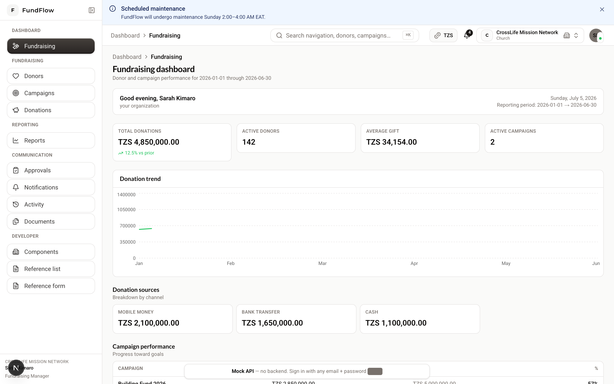
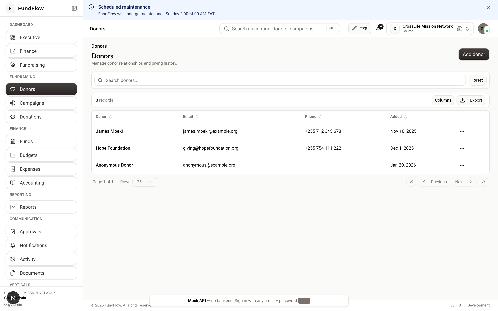
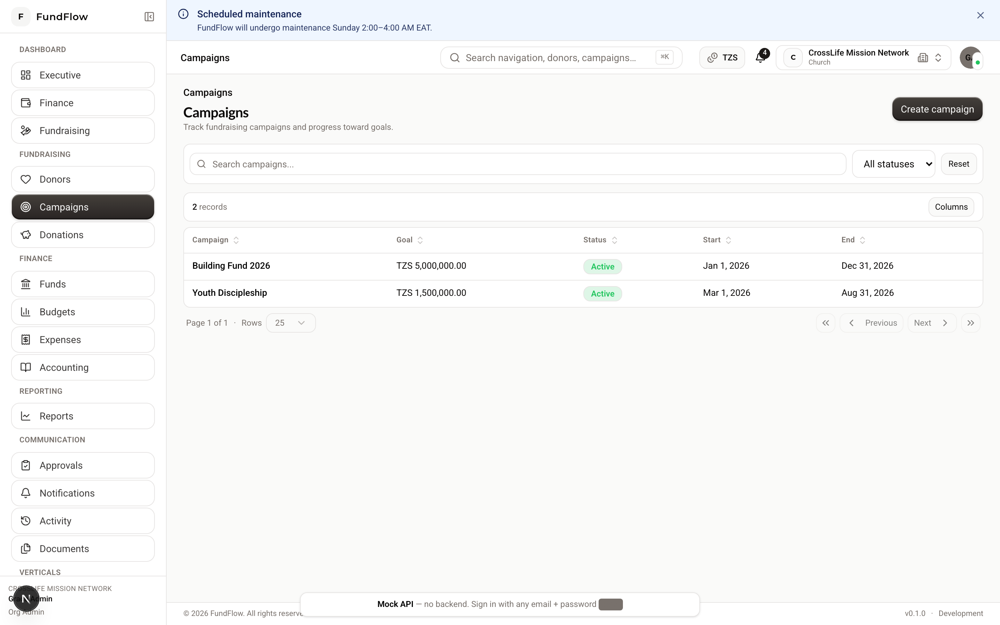
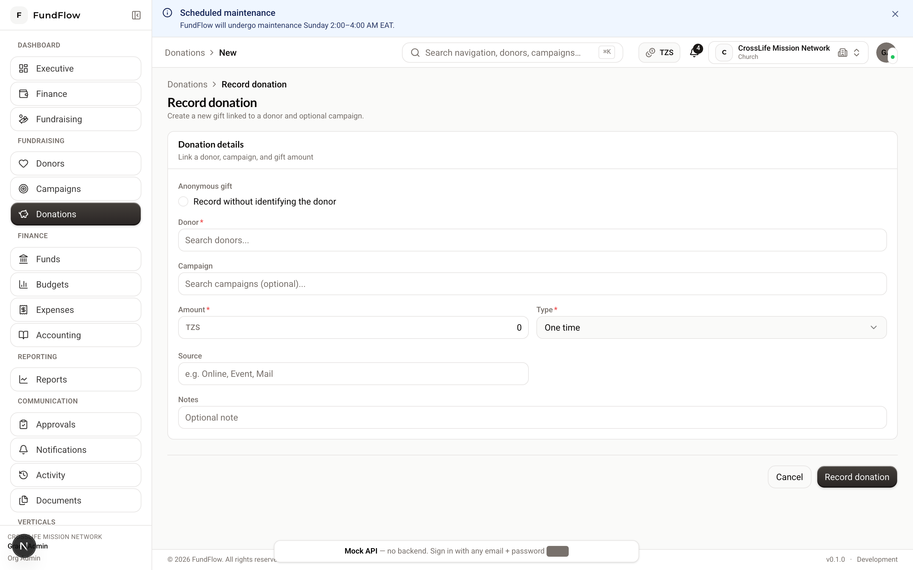
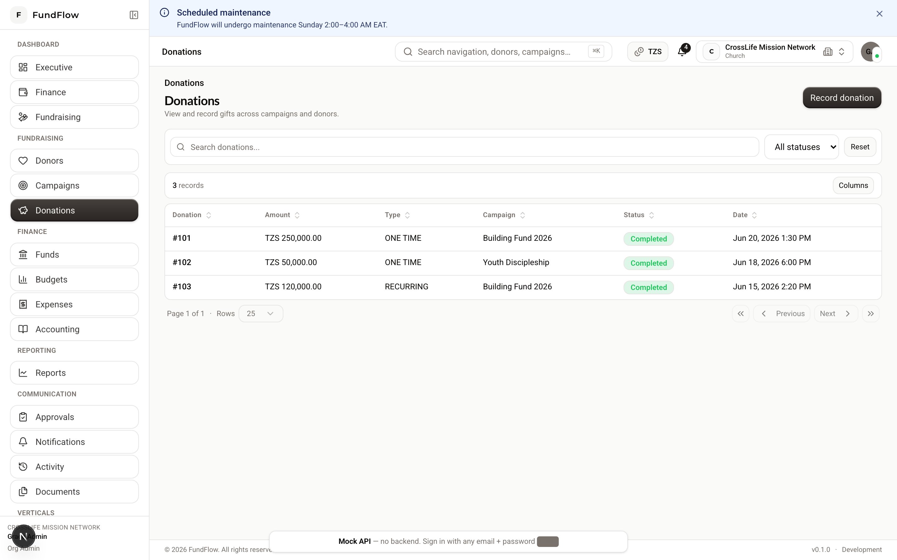

# Fundraising Guide

**Audience:** `FUNDRAISING_MANAGER`, `STAFF` (and `ORG_ADMIN`, `FINANCE_MANAGER` where noted)  
**Dashboard:** `/dashboard/fundraising`

---

## What you do in FundFlow

- Build and maintain your **donor database**  
- Run **fundraising campaigns** with targets and deadlines  
- **Record donations** and link them to donors, funds, and campaigns  
- Track payment status and receipts  

---

## Daily navigation

| Task | Menu path |
|------|-----------|
| Donors | Fundraising → Donors (`/donors`) |
| Campaigns | Fundraising → Campaigns (`/campaigns`) |
| Donations | Fundraising → Donations (`/donations`) |
| Dashboard | Dashboard → Fundraising |

Press **⌘K / Ctrl+K** and type "donor", "campaign", or "donation" to jump quickly.

{ width="720" }

*Figure: Fundraising dashboard — campaign progress and donation trends.*

---

## Guide 1 — Add a donor

1. **Fundraising → Donors → New donor** (`/donors/new`)  
2. Enter:
   - Full name (or organization name for corporate donors)  
   - Email, phone (optional but recommended for receipts)  
   - Notes or tags (optional)  
3. **Save**  

{ width="720" }

*Figure: Donors list — search, filter, and open donor profiles.*

**Tip:** Create donors before recording donations so history stays linked.

---

## Guide 2 — Create a campaign

1. **Fundraising → Campaigns → New campaign** (`/campaigns/new`)  
2. Enter:
   - **Title** and description  
   - **Target amount**  
   - **Start** and **end** dates  
   - Linked **fund** (coordinate with finance if unsure)  
3. **Save**  
4. Open the campaign and **activate** when you're ready to accept gifts  

{ width="720" }

*Figure: Campaigns list — progress toward targets and campaign status.*

### Monitor progress

- Open campaign **detail page** (`/campaigns/[id]`)  
- View amount raised vs. target  
- Link each new donation to this campaign when recording  

### Close a campaign

When the drive ends, close the campaign from its detail page and run **Reports → Campaign reports**.

---

## Guide 3 — Record a donation

1. **Fundraising → Donations → Record donation** (`/donations/new`)  
2. Select **donor** (or mark **anonymous**)  
3. Enter **amount** and **date**  
4. Select **fund** (required for proper accounting)  
5. Optionally select **campaign**  
6. **Save**  

{ width="720" }

*Figure: Record donation — select donor, fund, campaign, and amount.*

### What happens next

```
Donation created → Payment recorded → Receipt generated
    → Journal entry posted → Shows in reports
```

{ width="720" }

*Figure: Donations list — track status and open detail for payments.*

---

## Guide 4 — Record payment

A donation is not complete until payment is recorded.

Open the donation detail page (`/donations/[id]`) → **Record payment**

| Method | Who can use it |
|--------|----------------|
| **Gateway** (card, mobile money) | Staff, Fundraising, Finance, Admin |
| **Manual** (cash, cheque) | Finance Manager, Org Admin only |

**Staff workflow:** Record the donation → notify Finance Manager to record manual cash/cheque payments.

---

## Guide 5 — Work with an existing donor

1. **Fundraising → Donors** — search or browse  
2. Click donor name → **detail page**  
3. Review:
   - Contact information  
   - Donation history  
   - Total giving  
4. **Edit** to update contact details  

---

## Guide 6 — Review fundraising performance

| Where | What you see |
|-------|----------------|
| Fundraising dashboard | KPIs, trends, quick actions |
| Reports → Donations | Gifts by period, fund, campaign |
| Reports → Campaigns | Per-campaign totals and progress |

Export CSV from report pages for board meetings or external analysis.

---

## Permissions summary

| Action | Fundraising Manager | Staff |
|--------|---------------------|-------|
| Create/edit donors | ✓ | ✓ |
| Delete donors | ✓ | ✗ |
| Create campaigns | ✓ | ✓ |
| Delete campaigns | ✓ | ✗ |
| Record donations | ✓ | ✓ |
| Gateway payment | ✓ | ✓ |
| Manual payment | ✗ | ✗ |

---

## Church: group offerings (Sunday service)

For counted cash offerings (entire congregation), your finance team may use **collection sessions** (API workflow). After counting:

1. Staff creates and submits the session count  
2. Finance Manager **verifies** → one consolidated donation is created  

See [Church Guide](./church.md) for details.

---

## Best practices

1. **Always assign a fund** — unrestricted vs. restricted matters for reporting  
2. **Link campaigns** while the drive is active — progress updates automatically  
3. **Record payments promptly** — reports only reflect completed gifts  
4. **Keep donor emails accurate** — automated receipts use organization email settings  

---

**Related:** [Finance Guide](./finance.md) · [Reports Guide](./reports.md) · [Church Guide](./church.md)
