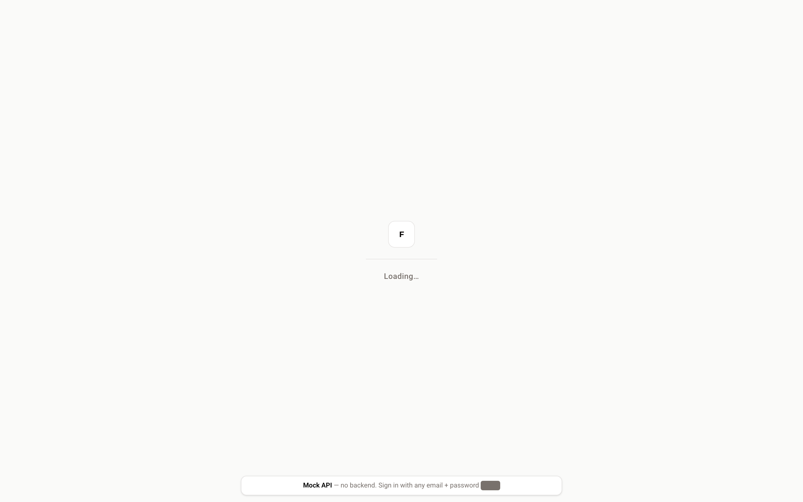
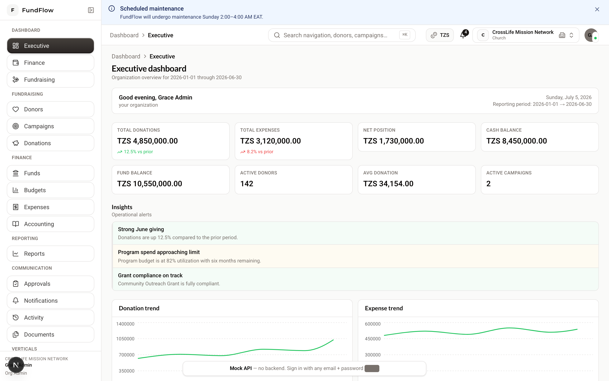
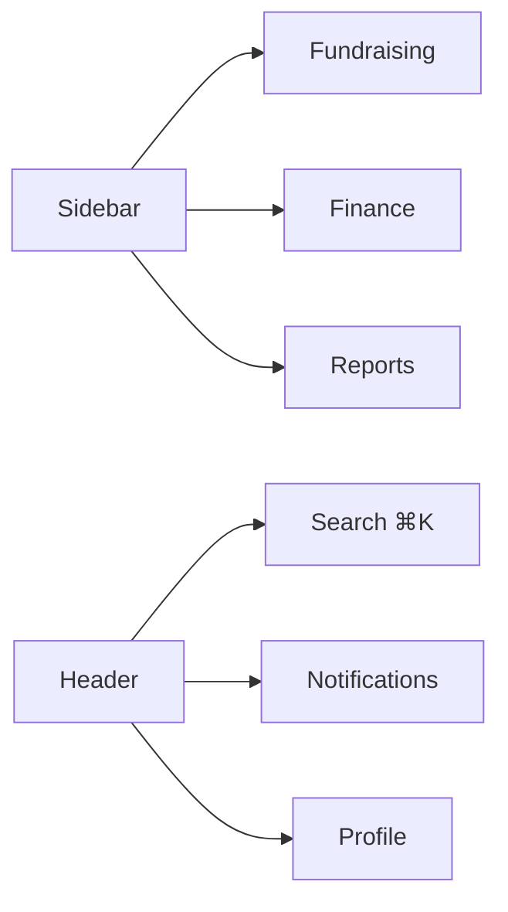

# Getting Started Guide

**Audience:** Anyone new to FundFlow ERP  
**Time:** ~15 minutes to first login

---

## What is FundFlow?

FundFlow ERP helps nonprofits manage **donations**, **expenses**, **funds**, **accounting**, **budgets**, and **reports** in one place. Your organization’s data is private — no other tenant can see it.

---

## Quick start (local evaluation)

### 1. Start the database

```bash
docker compose up -d
```

### 2. Start the backend

```bash
./mvnw spring-boot:run
```

API: http://localhost:8080

### 3. Start the frontend

```bash
cd frontend
cp .env.local.example .env.local
npm install
npm run dev
```

App: http://localhost:3000

{ width="720" }

*Figure: Sign-in page. Demo mode: `admin@demo.local` / `demo`.*

**UI-only demo:** Set `NEXT_PUBLIC_MOCK_API=true` in `frontend/.env.local` to explore without the backend.

---

## Create your account

1. Open http://localhost:3000/register  
2. Fill in:
   - Organization name and **type** (Church, NGO, School, etc.)
   - Organization email
   - Your name, email, and password (min. 8 characters)
3. Click **Create account**  
4. You are the **Organization Admin** for your new organization  

→ Continue with the [Organization Admin Guide](./organization-admin.md) setup wizard.

---

## Sign in

1. Go to http://localhost:3000/login  
2. Enter email and password  
3. You land on a dashboard based on your role:

| Role | Dashboard |
|------|-----------|
| Finance Manager / Accountant | Finance |
| Fundraising Manager | Fundraising |
| Everyone else (default) | Executive |

{ width="720" }

*Figure: Executive dashboard — overview KPIs, charts, and quick actions.*

---

## Navigate the app

| Area | What it does |
|------|----------------|
| **Sidebar** | Main menus (Fundraising, Finance, Reports, etc.) |
| **Header** | Search, notifications, your profile |
| **⌘K / Ctrl+K** | Command palette — jump to any page quickly |
| **Breadcrumbs** | Back trail at top of each page |

On mobile, tap the **menu icon** to open the sidebar drawer.



*Diagram: Main areas of the application shell.*

---

## What to do first

| Your role | Next guide |
|-----------|------------|
| Organization Admin | [Organization Admin](./organization-admin.md) |
| Fundraising | [Fundraising](./fundraising.md) |
| Finance | [Finance](./finance.md) |
| Accounting | [Accounting](./accounting.md) |
| Program / NGO work | [Programs & Grants](./programs-and-grants.md) |
| Church staff | [Church](./church.md) |
| School staff | [School](./school.md) |

---

## Common issues

| Problem | Fix |
|---------|-----|
| Can't log in | Check email/password; ask your admin if the account is active |
| Missing menu items | Your role or org type may not include that module |
| Blank data in dev | Start PostgreSQL + backend; or use mock API mode |

---

**Next:** [Organization Admin Guide](./organization-admin.md) · [Full manual](../USER_MANUAL.md)
