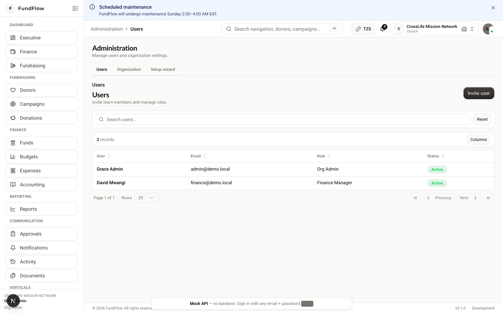
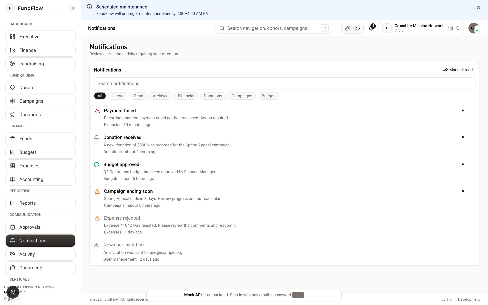

# Organization Admin Guide

**Audience:** `ORG_ADMIN` — organization owners and primary administrators  
**You can:** Manage users, settings, and most write operations across the platform

---

## Your responsibilities

As Organization Admin you typically:

1. Complete initial organization setup  
2. Invite finance, fundraising, and program staff  
3. Initialize accounting and funds  
4. Oversee settings and user access  

---

## Setup wizard (first login)

**Path:** `/admin/setup`

{ width="720" }

*Figure: Administration → Users — invite team members and assign roles.*

| Step | Action |
|------|--------|
| **1. Profile** | Confirm org name, type, contact email, fiscal preferences → **Save** |
| **2. Invite team** | Add Finance Manager, Fundraising Manager, or Staff with email + role |
| **3. Get started** | Use shortcuts to donors, campaigns, funds, or chart of accounts |

You can skip inviting users and return later via **Administration → Users**.

---

## Invite users

**Path:** `/admin/users` → **Invite user**

1. Enter **email**, **first name**, **last name**  
2. Choose a **role**:

| Role | Give this to… |
|------|----------------|
| `FINANCE_MANAGER` | Person who approves expenses, manages funds/budgets |
| `FUNDRAISING_MANAGER` | Person who runs campaigns and donor relations |
| `ACCOUNTANT` | Person who maintains chart of accounts and reviews ledger |
| `PROGRAM_MANAGER` | Person who runs programs/grants (NGOs) |
| `STAFF` | General data entry |
| `AUDITOR` / `VIEW_ONLY` | Read-only oversight |

3. Send invitation  

### Change a role later

1. **Administration → Users**  
2. Click the user  
3. Update role and save  

You **cannot** change your own role or assign `SUPER_ADMIN`.

---

## Organization settings

**Path:** `/admin/settings`

Update:

- Organization display name and contact details  
- Organization type (affects which vertical menus appear)  
- Operational preferences  

---

## Recommended onboarding checklist

Complete these in order for a healthy start:

- [ ] Finish setup wizard profile  
- [ ] Invite Finance Manager and Fundraising Manager  
- [ ] **Finance → Funds** — create at least one restricted and one unrestricted fund  
- [ ] **Accounting → Chart of accounts** — click **Initialize**  
- [ ] **Fundraising → Donors** — add your first donor  
- [ ] **Fundraising → Campaigns** — create an active campaign  
- [ ] Record a **test donation** and confirm it appears in **Reports → Donations**  
- [ ] Submit a **test expense** and approve it as finance (or have Finance Manager do so)  

---

## Dashboards you can access

| Dashboard | Path |
|-----------|------|
| Executive | `/dashboard/executive` |
| Finance | `/dashboard/finance` |
| Fundraising | `/dashboard/fundraising` |

As admin you have broad access; delegate day-to-day work to specialist roles.

---

## Administration menu

| Item | Path | Purpose |
|------|------|---------|
| Users | `/admin/users` | Invite and manage team |
| Settings | `/admin/settings` | Organization profile |

---

## Approvals and oversight

- **Communication → Approvals** (`/approvals`) — pending expense and workflow items  
- **Communication → Activity** (`/activity`) — audit-style event feed  

{ width="720" }

*Figure: Notification center — alerts for approvals and workflow events.*  
- **Reporting → Reports** (`/reports`) — export financial summaries for leadership  

---

## Organization types and vertical features

Your type at registration controls extra menus:

| Type | Extra features |
|------|----------------|
| Church / Religious institution | [Church Guide](./church.md) |
| School | [School Guide](./school.md) |
| NGO, Foundation, Charity, Community org | [Programs & Grants](./programs-and-grants.md) |

---

**Related:** [Finance Guide](./finance.md) · [Fundraising Guide](./fundraising.md) · [RBAC_MATRIX.md](../RBAC_MATRIX.md)
