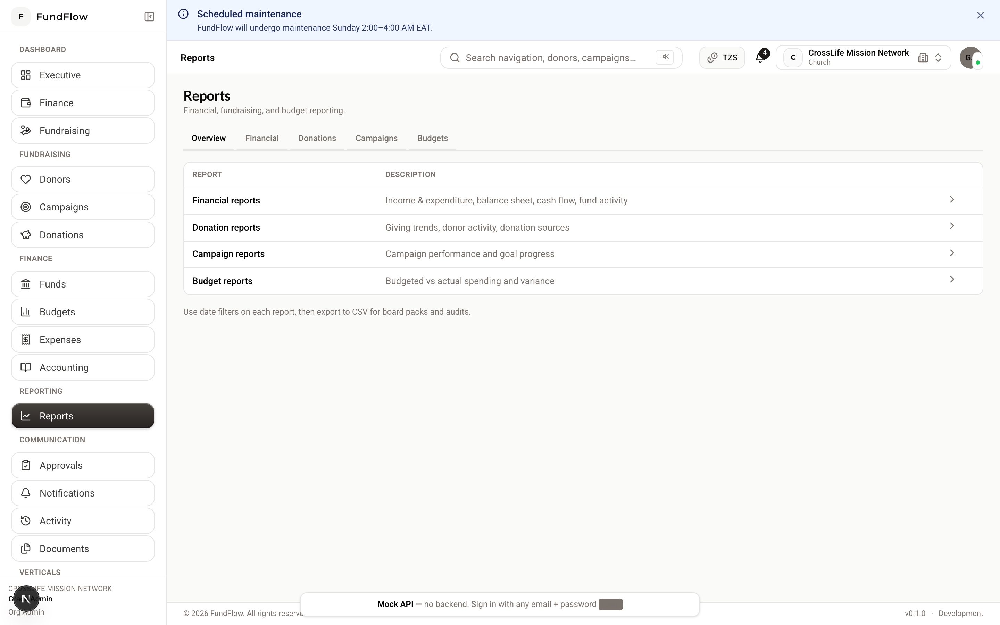

# Reports Guide

**Audience:** `ORG_ADMIN`, `FINANCE_MANAGER`, `FUNDRAISING_MANAGER`, `ACCOUNTANT`, `PROGRAM_MANAGER`, `AUDITOR`, `VIEW_ONLY`

---

## What reports answer

| Question | Report type |
|----------|-------------|
| How much did we receive? | Donation reports |
| How did each campaign perform? | Campaign reports |
| Are we on budget? | Budget reports |
| What is our financial position? | Financial reports |
| Can auditors verify transactions? | Financial reports + General ledger + Activity |

**Hub:** `/reports`

---

## Navigation

| Report | Path |
|--------|------|
| Report hub | `/reports` |
| Financial | `/reports/financial` |
| Donations | `/reports/donations` |
| Campaigns | `/reports/campaigns` |
| Budgets | `/reports/budgets` |

{ width="720" }

*Figure: Reports hub — links to financial, donation, campaign, and budget reports.*

---

## Guide 1 — Run any report

1. **Reporting → Reports**  
2. Choose report type  
3. Set filters:
   - **Date range** (required for most reports)  
   - **Fund** (optional)  
   - **Campaign** (donation/campaign reports)  
   - **Budget** (budget reports)  
4. Review on screen  
5. Click **Export** for **CSV** download  

---

## Guide 2 — Financial reports

**Path:** `/reports/financial`

Typical contents:

- **Income & expenditure** (statement of activities)  
- **Balance sheet** (statement of financial position)  
- **Cash flow** summary  

**Best for:** Board meetings, annual filings, executive dashboard validation.

**Before running:** Ensure donations are paid and expenses are approved/paid for the period.

---

## Guide 3 — Donation reports

**Path:** `/reports/donations`

Filter by:

- Date range  
- Fund  
- Campaign  
- Donor (where supported)  

**Best for:** Fundraising reviews, donor stewardship, fund restriction compliance.

---

## Guide 4 — Campaign reports

**Path:** `/reports/campaigns`

Shows per-campaign:

- Total raised  
- Progress vs. target  
- Donation count  

**Best for:** Closing campaigns, donor communications, campaign retrospectives.

---

## Guide 5 — Budget reports

**Path:** `/reports/budgets`

Shows:

- Planned vs. actual by line  
- **Variance** (over/under budget)  

**Best for:** Finance committee, program managers, mid-year corrections.

---

## Guide 6 — Auditor workflow

Auditors typically need:

1. **Financial reports** for the fiscal year  
2. **General ledger** (`/accounting/general-ledger`) — transaction detail  
3. **Trial balance** (`/accounting/trial-balance`) — debits = credits  
4. **Donation reports** — source of income  
5. **Expense list** with approval history  
6. **Activity feed** (`/activity`) — who changed what  
7. **Documents** (`/documents`) — supporting receipts and grant letters  

Export CSV/PDF where available; provide read-only `AUDITOR` or `VIEW_ONLY` accounts when possible.

---

## Guide 7 — Executive monthly pack

Suggested monthly bundle for leadership:

| # | Deliverable | Source |
|---|-------------|--------|
| 1 | Executive dashboard snapshot | `/dashboard/executive` |
| 2 | Income & expenditure | `/reports/financial` |
| 3 | Donation summary | `/reports/donations` |
| 4 | Budget variance | `/reports/budgets` |
| 5 | Open approvals | `/approvals` |

---

## Tips

- **Date ranges:** Use consistent fiscal periods (calendar year vs. org fiscal year)  
- **Funds:** Run restricted and unrestricted reports separately for compliance  
- **Timing:** Run reports after month-end close, not mid-reconciliation  
- **Export:** CSV opens in Excel/Google Sheets for custom charts  

---

**Related:** [Accounting Guide](./accounting.md) · [Finance Guide](./finance.md) · [Fundraising Guide](./fundraising.md)
